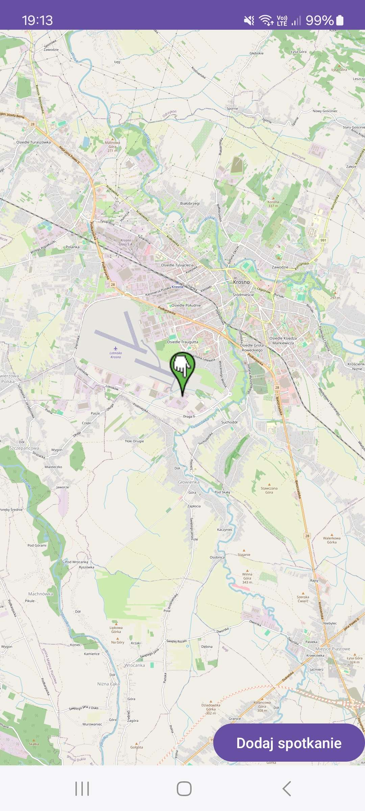
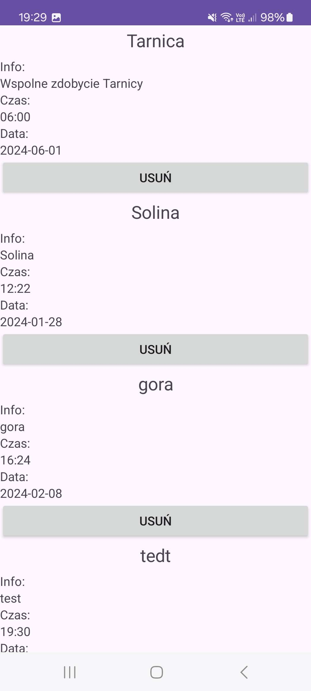

# EventMap: Android Application for Event Organization

## Overview
EventMap is an Android application designed to help users organize and manage events by creating and sharing meeting points on a map. Whether it's for events, parties, or casual meetups, users can easily create, view, and manage locations through their Google accounts. The app provides a seamless way to coordinate gatherings and keep track of various events.

## Features
- **Create Event Points**: Users can mark specific locations on a map to organize events or meetings.
- **Manage Events**: Edit or delete event points as needed to keep your plans updated.
- **Google Account Integration**: Securely manage events through Google account authentication.
- **Real-time Data**: Updates and changes are synchronized in real-time to ensure everyone has the latest information.

## Technologies Used
- **Firebase:** Provides real-time data synchronization and authentication.
- **Java:** Core programming language used for app development.
- **Android Studio:** Integrated development environment (IDE) used for building and managing the app.

### Image

